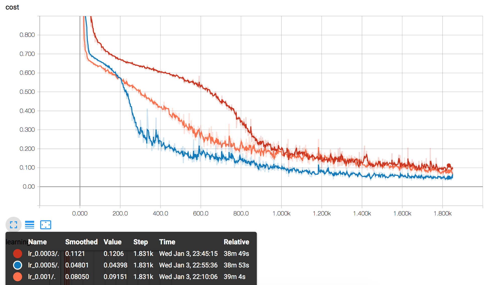
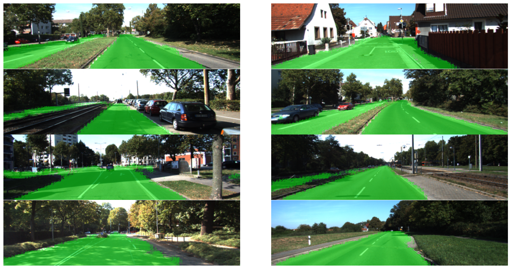

## Introduction
In this project, we practiced implementing a fully convolutional network based on a frozen trained VGG model. Especially, we used transposed convolutional operations to make sure the final dimension of the output is the same as the input images, hence enabling semantic segmentation.

## Overall graph of the model
From the frozen VGG model, the pooling layer 7,4,3 were loaded and upscaled to the size of the original image. Each layer was first connected to a 1x1 convolutional layer. Then the layers were sequentially combined and upsampled to the dimention of the previous layer, and enventually the dimention of the input image

Model Graph (tensorboard screenshot):

## Tuning parameters
Lots of parameters to tune, such as BATCH_SIZE, total EPOCH number, and initial learning rate.
Finally, BATCH_SIZE of 8, EPOCH number of 50, and 0.0005 as the initial learning rate were chosen.
Here is the example of compaing 3 different initial learning rate (screenshot of the tensorboard):

lr (learning rate) = 0.001 (orange)

lr (learning rate) = 0.0005 (blue)

lr (learning rate) = 0.0003 (red)

Finally, chose 0.0005 as the initial learning rate.

## Example output
Overall, the results are decent. 
Here are eight random images from the best run

