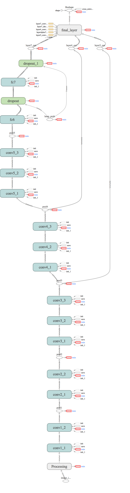

## Introduction
In this project, we practiced encoder and decoder, based on VGG model
briefly, the pool layer 7,4,3 were loaded and decoded to the size of the original image, and overlayed. 

## tf graph

Brief description           |  Model Graph (tensorboard screenshot)
:-------------------------:|:-------------------------:
  haha |  
